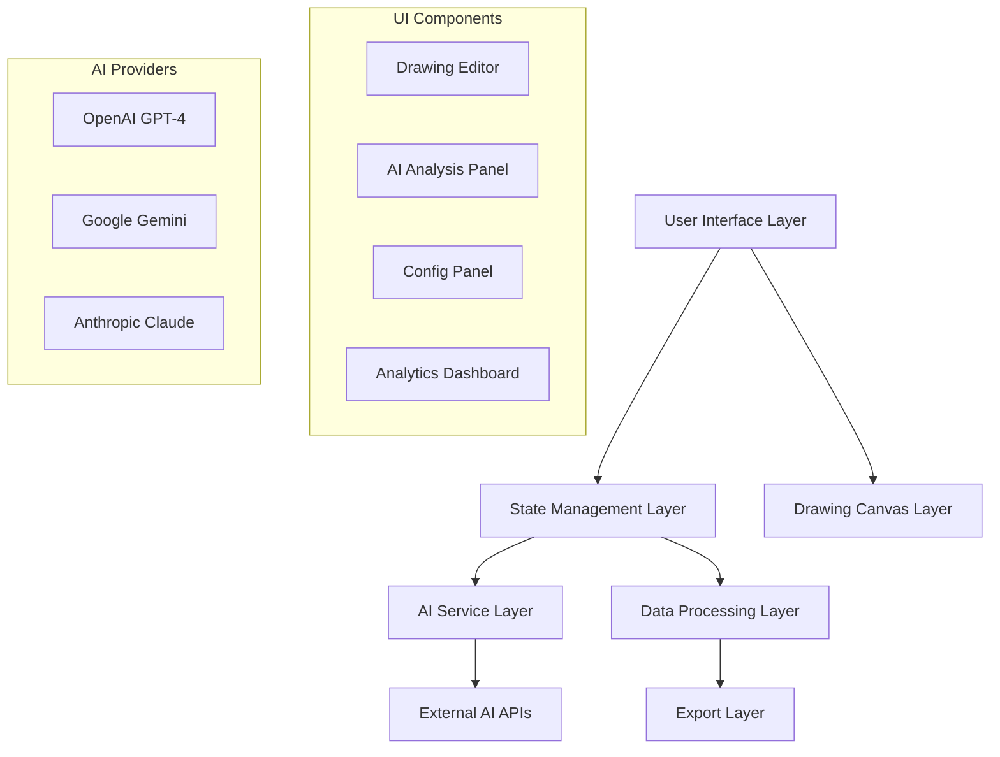

# High-Level Design (HLD)

## System Architecture

### 1. Overview

The AI-Powered User Journey Analytics Tool is a client-side web application that transforms user-drawn journey diagrams into actionable analytics specifications through AI analysis.

### 2. Core Components



### 3. Data Flow Architecture

```
User Drawing → Canvas Capture → AI Analysis → Event Generation → Export
     ↓                                ↓              ↓             ↓
  tldraw                           AI APIs       Event Specs    JSON/Code
```

### 4. Key Architectural Decisions

#### 4.1 Client-Side Architecture

- **Decision**: Pure client-side implementation
- **Rationale**:
  - Reduced infrastructure costs
  - Better data privacy (no server-side data storage)
  - Simplified deployment
  - Direct AI API integration

#### 4.2 Multi-AI Provider Support

- **Decision**: Support multiple AI providers (OpenAI, Gemini, Claude)
- **Rationale**:
  - Redundancy and fallback options
  - Cost optimization based on provider pricing
  - Different models excel at different tasks
  - Future-proofing against API changes

#### 4.3 React Context for State Management

- **Decision**: Use React Context instead of external state management
- **Rationale**:
  - Lightweight for current complexity
  - No additional dependencies
  - Sufficient for current use case
  - Easy to migrate to Redux/Zustand if needed

#### 4.4 tldraw for Drawing Canvas

- **Decision**: Use tldraw library for drawing interface
- **Rationale**:
  - Production-ready drawing capabilities
  - Excellent TypeScript support
  - Extensible and customizable
  - Active development and community

### 5. System Boundaries

#### 5.1 In Scope

- Drawing interface for user journey creation
- AI analysis of drawings
- Event specification generation
- Configuration management
- Export functionality

#### 5.2 Out of Scope (Future Phases)

- Real-time collaboration
- Server-side storage
- Advanced analytics visualization
- Integration with specific analytics platforms
- User authentication

### 6. Technology Stack Justification

| Technology       | Purpose        | Justification                                                   |
| ---------------- | -------------- | --------------------------------------------------------------- |
| React 18         | UI Framework   | Modern, well-supported, excellent TypeScript integration        |
| TypeScript       | Type Safety    | Reduces bugs, better developer experience, easier refactoring   |
| Vite             | Build Tool     | Fast development, excellent TypeScript support, modern bundling |
| tldraw           | Drawing Canvas | Mature drawing library, extensible, great TypeScript support    |
| Tailwind CSS     | Styling        | Utility-first, consistent design, rapid development             |
| Multiple AI APIs | AI Analysis    | Provider redundancy, cost optimization, capability diversity    |

### 7. Performance Considerations

#### 7.1 Drawing Performance

- Optimized canvas rendering through tldraw
- Efficient state updates
- Minimal re-renders

#### 7.2 AI Processing

- Async processing with loading states
- Fallback mechanisms for failed API calls
- Token limit management for large drawings

#### 7.3 Memory Management

- Cleanup of drawing snapshots
- Efficient JSON serialization
- Browser storage optimization

### 8. Security Considerations

#### 8.1 API Key Security

- Client-side storage in localStorage
- No transmission to external servers
- User-controlled key management

#### 8.2 Data Privacy

- No server-side data storage
- Local processing only
- User controls all data export

### 9. Scalability Plan

#### Phase 1 (Current)

- Single-user, client-side application
- Basic AI analysis capabilities
- Manual configuration

#### Phase 2 (Future)

- Multi-user support
- Real-time collaboration
- Advanced AI models

#### Phase 3 (Advanced)

- Enterprise features
- Custom model training
- Analytics platform integrations

### 10. Integration Points

#### 10.1 External APIs

- OpenAI GPT-4 API
- Google Gemini API
- Anthropic Claude API

#### 10.2 Data Formats

- Input: tldraw StoreSnapshot
- Processing: JSON structures
- Output: Event specifications, tracking code

### 11. Error Handling Strategy

#### 11.1 AI API Failures

- Graceful degradation to fallback providers
- Mock data generation for development
- Clear error messaging to users

#### 11.2 Drawing Canvas Issues

- Auto-save functionality
- Recovery mechanisms
- State persistence

### 12. Monitoring and Observability

#### 12.1 Client-Side Logging

- Console logging for debugging
- Error tracking and reporting
- Performance metrics

#### 12.2 AI Analysis Metrics

- Confidence scores
- Processing times
- Success/failure rates

## Implementation Phases

### Phase 1: Core Functionality ✅

- Drawing interface
- Basic AI analysis
- Event generation
- Export capabilities

### Phase 2: Enhanced AI (In Progress)

- Multiple AI provider support
- Improved analysis accuracy
- Advanced event detection

### Phase 3: Advanced Features (Planned)

- Real-time collaboration
- Version control
- Advanced export options
- Custom event taxonomies
