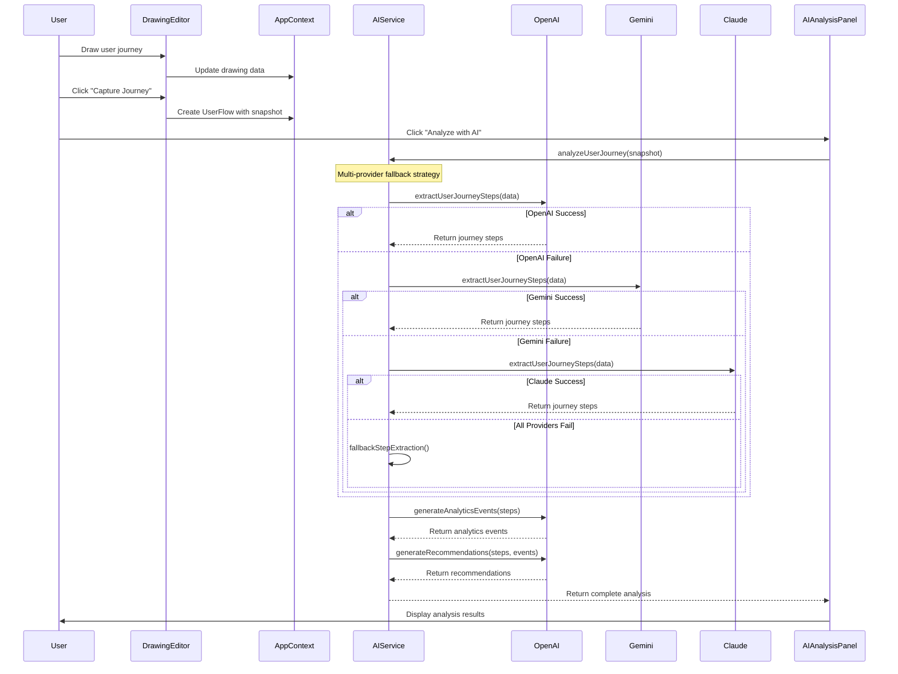
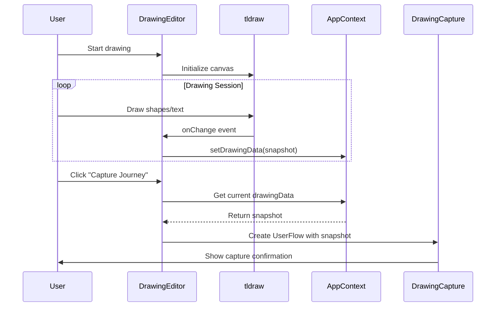
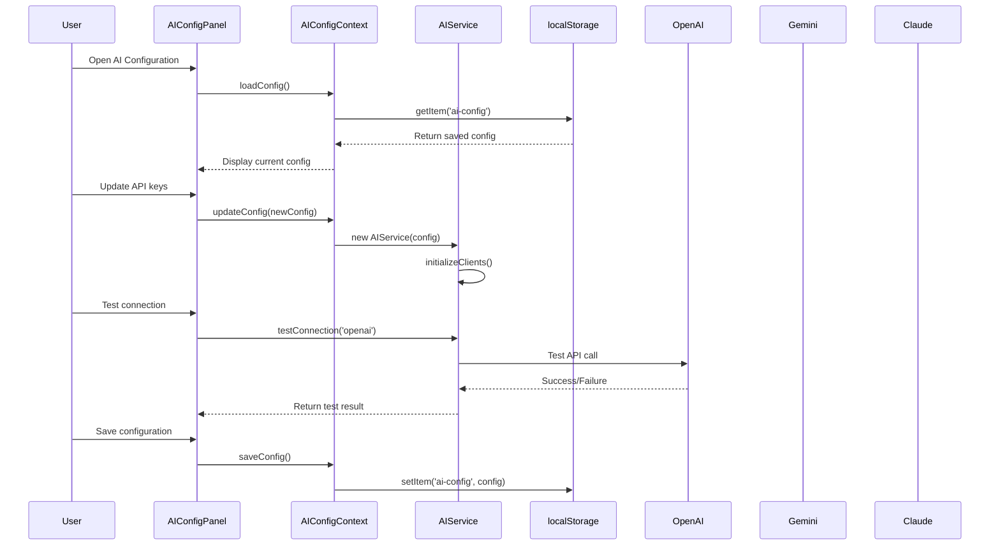
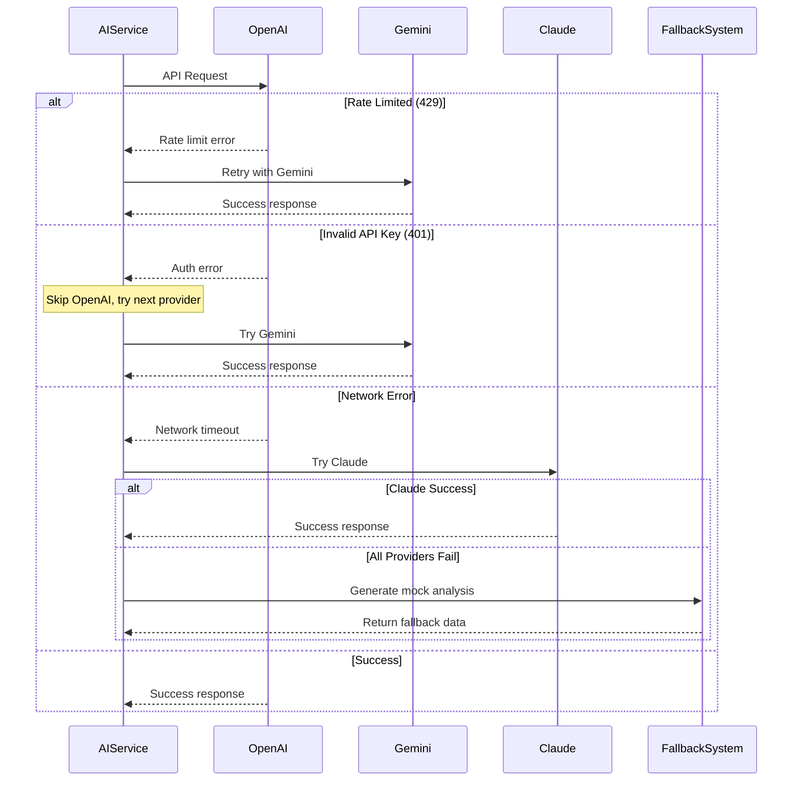
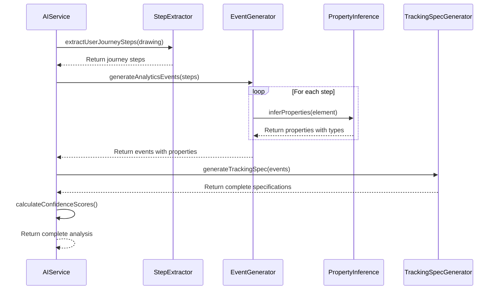
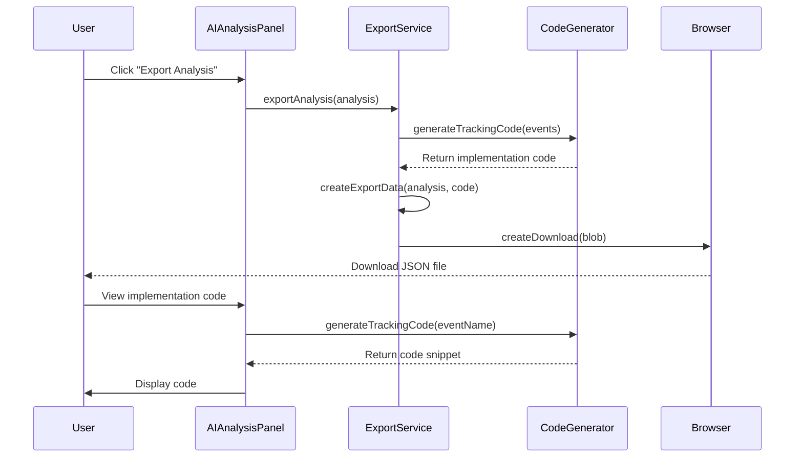
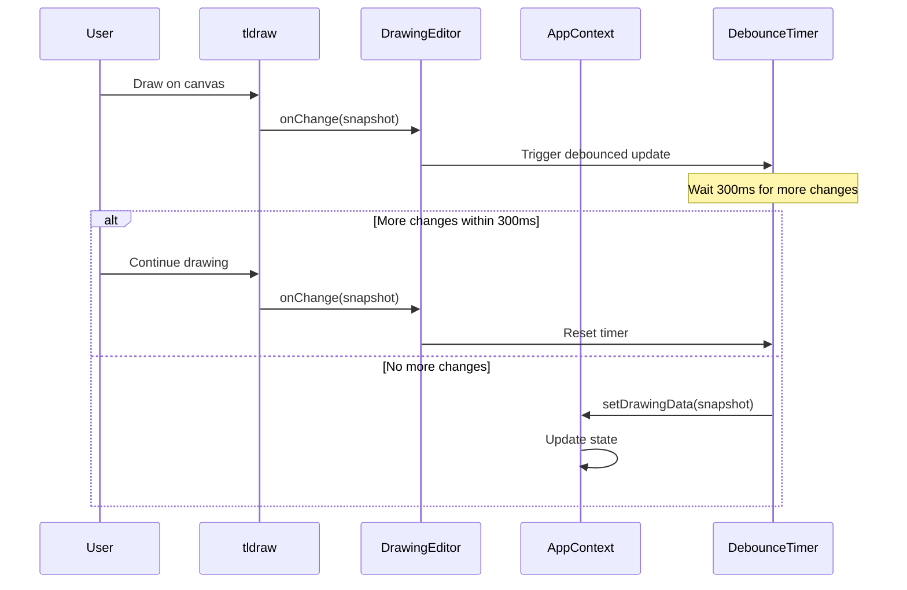
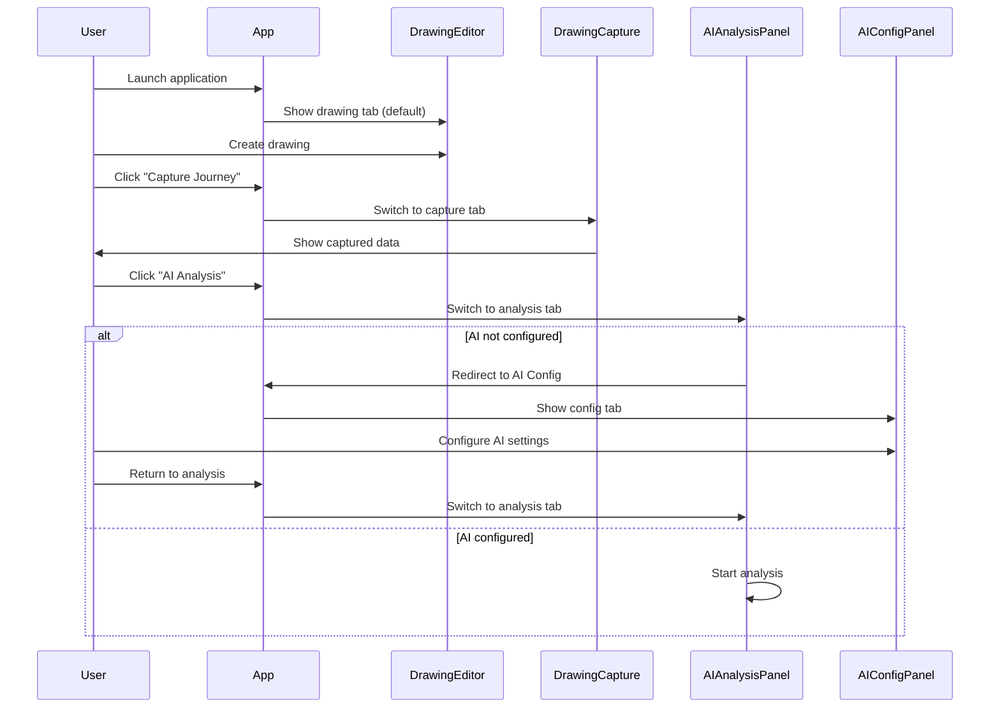
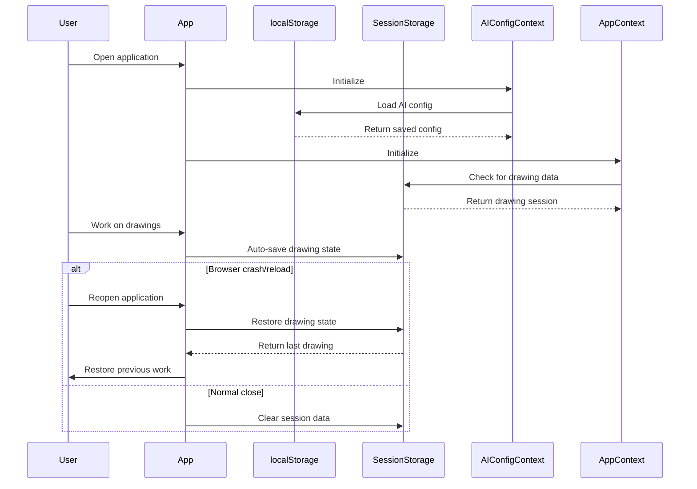
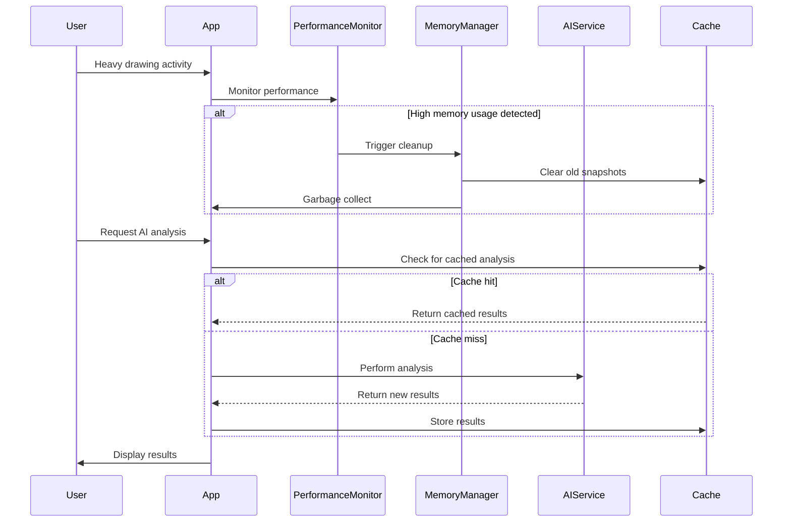

# Sequence Diagrams

## 1. Complete User Journey Analysis Flow

## 2. Drawing Capture and State Management

## 3. AI Configuration and Service Initialization

## 4. Error Handling and Fallback Strategy

## 5. Event Generation and Property Inference

## 6. Export and Code Generation

## 7. Real-time Drawing Updates

## 8. Multi-tab Interface Navigation

## 9. Data Persistence and Recovery

## 10. Performance Optimization Flow

